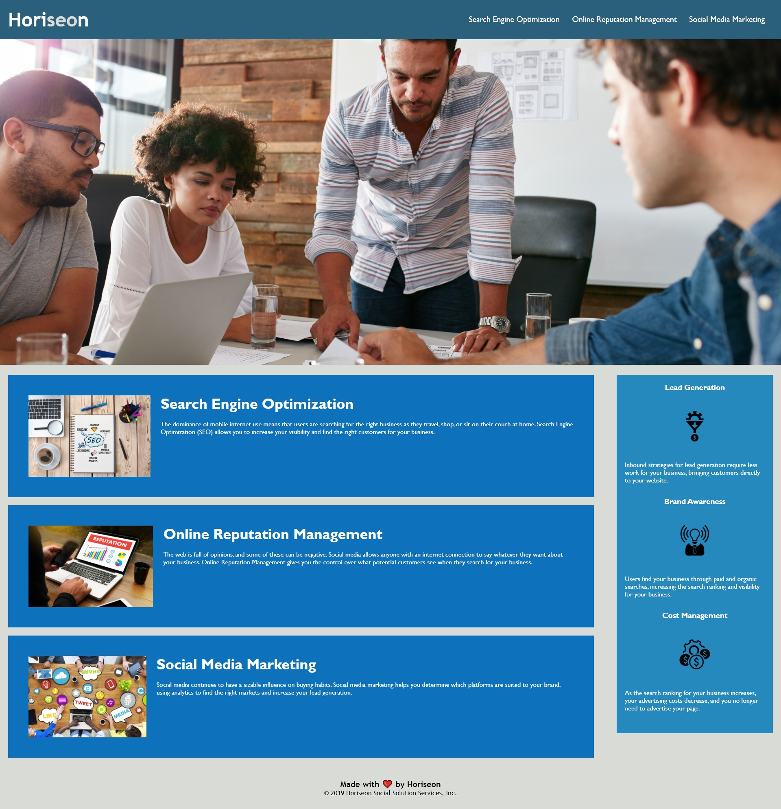

# The Semantic Organization Of Html Codes

## Subject: The Business rules!

## Description:
This is a website that shows how to run a successfull online business, with have in mind a small development project of teaching HTML and CSS best practices.
For that reason, i have decided to divide the website into four sections and apply html semantic rules, css organzisation. This Project aims to help html and css newbies to fully understand how to structure their codes semantically and make them self-explanatory.  


### See Website
[Click Here](https://lemanou7.github.io/week1-homework/) to download Vs Code to your computer.


### Installation


<!-- GETTING STARTED -->

This is some useful steps, you must meet to run this html and css code correctly 

### Prerequisites
You can use any code editor of user choise, i use Vs Code because it is open source and it understand git and do syntax highlighting very nicely.

* Go to
  [Click Here](https://code.visualstudio.com/download) to download Vs Code to your computer.
  

1. Clone the repo
   ```sh
   git clone https://github.com/lemanou7/week1-homework/
   ```
2. Get a linux shell emulator like Git bash or Powershell then:
    ```sh
    cd to where your repository folder is located in your computer
    ```
  
3. Run the html file by entering this command if using Vs Code
   ```sh
   code index.html
   ```
4. Run the html file by entering this command if using Vs Code
   ```sh
   code index.html
   ```
   Right Click and Click on the option: "Open in Defauld Browser" or Alt B


<!-- USAGE EXAMPLES -->
## Usage:

1. Showing The Header


2. Showing section


3. Showing The aside 


4. Showing The footer


5. Full Webpage 




<!-- CONTACT -->
## Contact

Drissa Bagate (<span style="color:#5ddcf0">**Django, Javascript Full Stack Developer**</span>) [GitHub](https://github.com/lemanou7) - lemanou7@yahoo.fr

Other Project link: [My Blog Post Python-Django Implemation](http://grandbuzz.herokuapp.com/)


